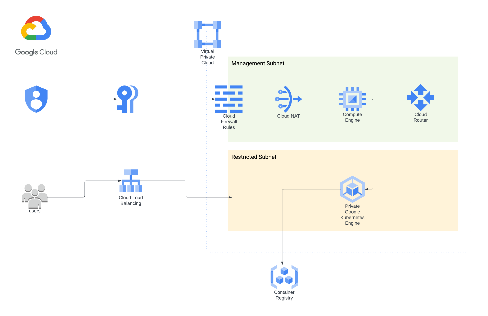
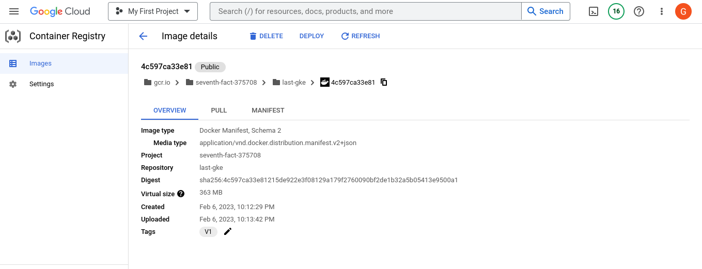
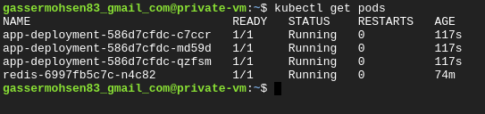
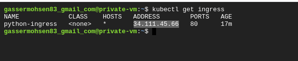
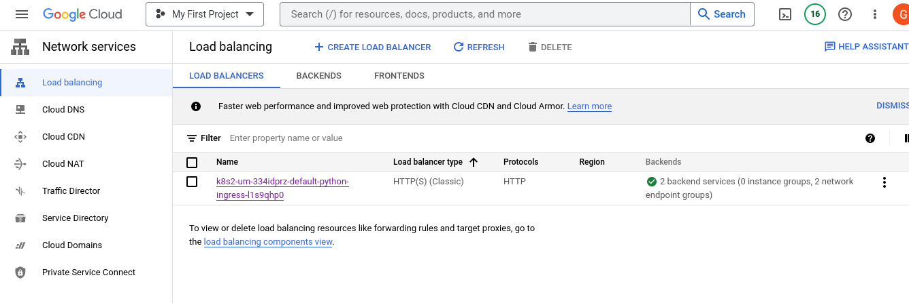
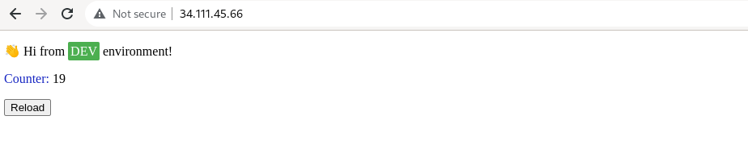

# GCP Final Task

----

###  Project Architecture




### What terraform builds in GCP

1) Virtual private cloud
2) Two subnets (Management & Restricted )
3) Management Subnet Contains 
   1) Firewall rule
   2) Cloud NAT
   3) Cloud Router
   4) Private Compute Instance
4) Restricted Subnet Contains 
   - Private GKE Cluster
5) Two service accounts for GKE & VM


###  To build the infrastructure using Terraform 

```bash
terraform init
terraform plan # To check all the infrastructure components
terraform apply 
```
---

### To Deploy the Python app on GKE you need


1) Create Dockerfile
```Dockerfile 
FROM python:3.7
WORKDIR /app
RUN apt-get update
RUN apt-get install python3-pip -y
COPY requirements.txt .
RUN pip install -r requirements.txt
COPY . .
ENTRYPOINT [ "python3" ,"hello.py" ]
```

2) Push this image to GCR 

```bash
docker build . -t last-gke:V1
docker tag last-gke:V1 gcr.io/seventh-fact-375708/last-gke:V1
docker push gcr.io/seventh-fact-375708/last-gke:V1
```




3) SSH to the private VM  
   1) Using the console or IAP
   2) Write this command to gain access on the cluster
     ```bash 
    gcloud container clusters get-credentials private-cluster --zone=us-central1-a
    ```
 4) Now you can access the cluster with kubectl commands 
---

## Kubernetes Stuff

#### 1) Create configMap to add the Enviromental variables 

```yaml
apiVersion: v1
kind: ConfigMap
metadata:
  name: python-redis-config
data:
  REDIS_PORT: "6379"
  REDIS_HOST: "redis"
  ENVIRONMENT: "DEV"
  PORT: "8000"
  REDIS_DB: "0"
       
```
#### 2) Create two deployments 
- One for the app built from the GCR Image we Pushed 
```yaml 
apiVersion: apps/v1
kind: Deployment
metadata:
  name: python-app-deployment
spec:
  replicas: 2
  selector:
    matchLabels:
      name: app
  template:
    metadata:
      labels:
        name: app
    spec:
      containers:
      - name: my-app
        image: gcr.io/seventh-fact-375708/last-gke:V1
        envFrom:
        - configMapRef:
            name: python-redis-config
        ports:
        - containerPort: 80
 
```
    
- Another Deployment for redis
```yaml
apiVersion: apps/v1 
kind: Deployment
metadata:
  name: redis
spec:
  selector:
    matchLabels:
      app: redis
  replicas: 1
  template:
    metadata:
      labels:
        app: redis
    spec:
      containers:
      - name: redis
        image: redis
        ports:
        - containerPort: 6379
``` 


---

#### 3) Create ClusterIP Service for redis 
```yaml

apiVersion: v1
kind: Service
metadata:
  name: redis
spec:
  selector:
    app: redis
  ports:
  - port: 6379
    targetPort: 6379
```

#### 4) Create NodePort Service to be used by the Ingress 

```yaml


apiVersion: v1
kind: Service
metadata:
  name: ingress-service
spec:
  type: NodePort
  selector:
    name: app
  ports:
    - port: 80
      targetPort: 8000
      nodePort: 30005
```

#### 5) Since Google Kubernetes Engine (GKE) provides a built-in and managed Ingress controller called GKE Ingress , so no need to add ingress controller , know we create the ingress itself.
```yaml
apiVersion: networking.k8s.io/v1
kind: Ingress
metadata:
  name: python-ingress
spec:
  rules:
  - http:
      paths:
      - path: /
        pathType: Prefix
        backend:
          service:
            name: ingress-service
            port:
              number: 80
```
> **_NOTE:_** While creating Ingress , The GKE Ingress controller creates and configures an HTTP(S) Load Balancer Automatically

- Ingress Created Successfully with the loadbalancer IP Address


- Loadbalancer from the console
  



- Accessing The app through the loadbalancer IP 
  



